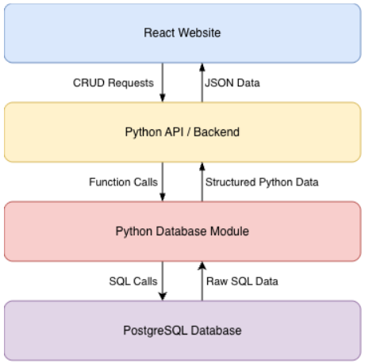
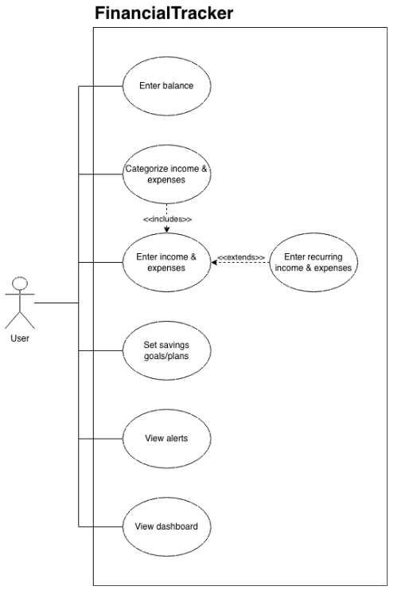

# PROJECT Design Documentation

## Team Information
* Team name: FinancialTracker
* Team members
  * Taylor Lineman
  * Ella Natter
  * Connor Novak
  * Leon Letournel
  * Tenzin Dhondup

## Executive Summary

FinancialTracker is a web app for managing personal finances. Users can track their income and expenses, set budgets and savings goals, and view spending breakdowns as pie charts. The goal is to make it easy to understand where your money is going without spreadsheets.

## Requirements

This section describes the features of the application.

### Definition of MVP

A working web app where users can log their bank balance, record categorized income and expenses, set budgets, and see their spending visualized as pie charts. Includes date-range filtering, over-budget warnings, and monthly rollover tracking.

### MVP Features

1. **As a user** I want to be able to input a current bank account balance so that I can know how much money I have to spend.
2. **As a user** I want to be able to see my finances as a pie chart so I can visually see my spending habits.
3. **As a user** I want to be able to split my paycheck into different categories (ex., savings, rent) so that I can budget for different expenses.
4. **As a user** I want to be able to see my finances across different date ranges so that I can see how much I spent in the last month, year, etc.
5. **As a user** I want to be able to set some savings goals so that I can stay motivated with my progress towards my goals.
6. **As a user** I want to be able to create a savings plan/future estimates so that I can plan for the future.
7. **As a user** I want to be able to see if I go over my budget in a month so that I can stay on top of my finances.
8. **As a user** I want to be able to see a rollover of my expenses and savings each month so I can trend towards a positive budget.
9. **As a user** I want to be able to categorize my sources of income so that I know where my money is coming from.
10. **As a user** I want to be able to categorize my expenses so that I know what I am spending my money on.
11. **As a user** I want to be able to manage my finances through a simple, easy-to-understand interface so that I am not frustrated by tracking my finances.

## Architecture and Design

This section describes the application architecture.

### Software Architecture

The app uses a layered architecture with three tiers:

- **Presentation Layer (React):** Handles the UI: dashboard, pie charts, forms for transactions/budgets, and pages for managing goals and categories.
- **Application Layer (Python Flask):** REST API organized into blueprints (users, balance, expenses, goals, income). Uses Pydantic for validation. Handles business logic like budget checks and date filtering.
- **Database Layer (PostgreSQL):** Stores all data via psycopg2. Tables include users, balance_events, budget_goals, expense_category, and income_sources.

### Use Cases

The use case diagram shows the main ways a user interacts with the system:

- **Manage Balance:** Input and update current bank account balance.
- **Record Transactions:** Log income and expense transactions with a category and date.
- **Categorize Finances:** Create expense categories (rent, groceries, etc.) and income sources (salary, freelance, etc.).
- **Split Paycheck:** Allocate parts of a paycheck to different categories like savings or rent.
- **Set Budgets:** Set monthly spending limits per category and get warned when going over.
- **Track Savings Goals:** Set savings targets with deadlines and track progress.
- **Plan Future Savings:** Project future savings based on current trends.
- **View Reports:** Filter finances by date range, view pie chart breakdowns, and see monthly rollover trends.

